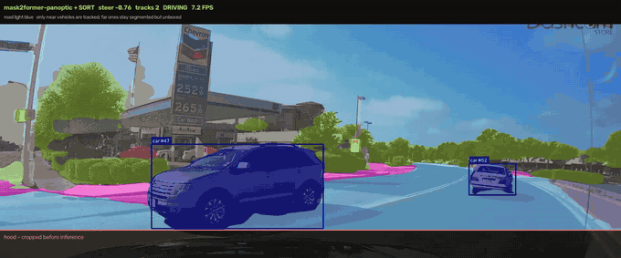

# Self-Driving RC Car — Campus Delivery Cart Prototype

A small autonomous vehicle built on [DonkeyCar](https://www.donkeycar.com/) and a
Raspberry Pi. The end goal is a **campus delivery cart**: it carries documents or
parcels between buildings with nobody driving it.

> **This is a prototype.** The point of this stage is to prove self-driving works
> end-to-end on cheap hardware before scaling it up.

## The three modes

The repo holds three separate ways of making the car see and steer. They do not
interfere with each other — modes 1 and 2 are picked by one flag in `myconfig.py`,
and mode 3 never runs on the car at all.

| | **1. DonkeyCar** | **2. SegFormer + OpenCV** | **3. Mask2Former** |
|---|---|---|---|
| What it does | Copies how *you* drive | Finds the walkable path and aims at it | Offline reference, measures modes 1–2 |
| How | CNN trained on your recordings | Segmentation mask → geometric steering | 215M-param panoptic model + tracking |
| Training data | You record it | None — model is pretrained | None |
| Runs on the Pi | Yes | Yes (~3.8M params) | **No** — ~7 FPS on a T4 GPU |
| Turn it on | `USE_CAMPUS_AUTONOMY = False` *(default)* | `USE_CAMPUS_AUTONOMY = True` | `scripts/vision_bench.py` on a laptop |
| Best for | Repeatable tracks, model comparison | Open campus paths it has never seen | Proving which changes actually matter |
| Code | stock DonkeyCar + `ibus_receiver.py` | `mycar/parts/` | `scripts/` |

**Status:** mode 1 is the active work. Mode 2 is written and benchmarked on real
footage but dormant. Mode 3 is a measuring tool, not a driving mode.

---

### Mode 1 — DonkeyCar (behavioral cloning)

You drive the car manually while it records camera frames paired with your
steering and throttle. A CNN learns to imitate you. On the track, the Pi feeds it
live frames and it outputs controls ~20 times a second.

```
Drive manually → Record data → Train CNN → Car drives itself
```

The experiment: train across **5–6 different track layouts** and hold one out, to
measure whether the model *generalizes* or just *memorizes*. Per-track models are
compared against one combined model on lap success rate. The two ablations that
matter are `linear` vs `categorical` output, and `ROI_CROP_TOP` on vs off —
cropping the top of the frame removes track-specific background and is the single
biggest anti-overfitting lever.

Set `CREATE_TF_LITE = True`. Training runs on x86 and inference on ARM, and
mismatched TensorFlow versions are the most common "model won't load" failure.

### Mode 2 — SegFormer + OpenCV pipeline

No training data. A pretrained segmentation model labels every pixel, the drivable
ones form a corridor, and steering is plain geometry over that corridor — plus a
stack of classical-CV and sensor layers that can override it:

- `seg_pilot.py` — drivable-area segmentation and geometric steering
- `yolo_guard.py` — pretrained pedestrian and obstacle detection
- `ultrasonic.py` — three HC-SR04 sonars, a reflex stop layer
- `breaker_detect.py` — speed-breaker stripes, pure OpenCV, no ML
- `gps_nav.py` — route following, junction commands, geofence
- `safety_arbiter.py` — priority merge into the final steering and throttle

### Mode 3 — Mask2Former perception testing



Mask2Former Swin-L panoptic with SORT tracking. Light blue is drivable road, pink
is sidewalk, boxes are the vehicles the tracker holds. **This is not the on-car
model** — it is far too heavy for a Pi. It exists to answer "is the small model's
mistake a perception problem or a steering problem?", and as an offline
auto-labeller for future fine-tuning.

## What the benchmarks showed

Measured on 30 s (900 frames) of public dashcam footage, 1080p30. Every run drives
the real car code — steering always comes from `SegEngine.steer_from_mask` — so a
change in the number is a change in the mask, not a change in the maths.

**1. The camera must never see the vehicle body.** The dash and hood filled the
bottom 34% of the frame, and the model labelled the dashboard itself as drivable:

| | drivable | steer on a straight road |
|---|---|---|
| body in frame | 45.6% | **-0.218** |
| `--crop-bottom 0.34` | 23.2% | **-0.022** |

Cropping must happen *before* inference; masking it out afterwards is too late,
because the road pixels beside the body are already contaminated.

**2. The drivable class list decides the corridor, not mask quality.** Same model,
same crop, same 674 frames — only the class list changed:

| profile | classes | steer mean | frames that would stop |
|---|---|---|---|
| road | sidewalk, crosswalk, cyclinglane, road, parkingdriveway | -0.079 | 2/674 |
| footpath *(default)* | sidewalk, crosswalk, cyclinglane | +0.039 | 154/674 |
| carriageway | road only | -0.115 | **460/674 (68%)** |

Too narrow a list stops the cart; too wide merges the path with traffic.

**3. Bigger input is monotonically worse.** Same checkpoint, same weights, only the
square input size changed:

| input | steer mean | mean \|Δsteer\| | drivable | frames that would stop |
|---|---|---|---|---|
| 256 | +0.010 | 0.0090 | 0.226 | 1/900 |
| 512 | -0.222 | 0.0346 | 0.203 | 38/900 |
| 768 | -0.141 | 0.0367 | 0.179 | **239/900** |

Stops explode and steering gets ~4x jumpier. Raising `SEG_INPUT_SIZE` is not a
quality fix — the real handicaps are capacity and domain, since the checkpoint was
fine-tuned on footage shot *walking on footpaths*, not from a windscreen.

**4. A bigger model fixes perception, not steering.** Mask2Former segments the kerb
line cleanly and never stops on this clip. But mean steering held between **-0.195
and -0.250** across all three perception setups — semantic, panoptic, and panoptic
with Kalman tracking. Better perception did not move it, because the error is in
the corridor rule, not the mask.

**Next:** use the large model offline as an **auto-labeller** over campus footage
and fine-tune the small on-car model on those pseudo-labels. Domain is what is
missing, and this buys it without hand-labelling.

## Hardware

```
FlySky Transmitter ──RF──▶ FlySky Receiver ──iBUS/UART──▶ Raspberry Pi ──I2C──▶ PCA9685 ──PWM──▶ Servo (steering)
                                                              │                              └───▶ ESC (throttle)
                                                          Pi Camera
```

- **FlySky TX/RX** — manual control, and channel 5 switches manual ↔ autopilot. It
  reaches the Pi over **iBUS** (all 14 channels on one digital wire, far cleaner
  than reading raw PWM).
- **Raspberry Pi** — runs the vehicle loop, reads iBUS, runs the model.
- **PCA9685** — I2C PWM driver. Direct GPIO PWM is too jittery for smooth steering.
- **Servo + ESC** — on an external battery rail; everything shares a common ground.
- **Camera** — front-facing, and the only sensor mode 1 uses.

## Repository structure

```
├── mycar/                  # DonkeyCar application
│   ├── manage.py           # Vehicle loop — drive, record, autopilot
│   ├── ibus_receiver.py    # Custom part: FlySky iBUS over UART
│   ├── myconfig.py         # Our overrides, including the mode flag
│   ├── calibrate.py        # Servo/ESC PWM calibration
│   ├── train.py            # Mode 1 training entry point
│   ├── data/               # Recorded frames + steering/throttle labels
│   └── parts/              # Mode 2 only — dormant unless the flag is on
├── scripts/                # Mode 3 tooling (laptop, not the Pi)
│   ├── export_models.py        # Download + quantize models, pick a profile
│   ├── build_campus_graph.py   # OpenStreetMap campus routing graph
│   └── vision_bench.py         # Offline go/no-go test on recorded footage
├── PROJECT_MEMORY.md       # Unified memory: architecture, hardware & protocols
├── AUTONOMY.md             # Mode 2 architecture and setup
├── BUILD_STAGES.md         # Wiring, tests, parts list
└── lanedetection.py        # Classic OpenCV lane follower (Canny + Hough)
```

`exported_models/` is gitignored — it holds model binaries, so the per-profile
label files are generated rather than committed. Reproduce any profile above with
`python scripts/export_models.py --profile <name>`.

## Getting started

```bash
python -m venv .venv
.venv\Scripts\activate        # Windows
pip install donkeycar[pc]     # on the Pi: donkeycar[pi]
```

Then, on the Pi:

```bash
cd mycar
python calibrate.py
python manage.py drive
python train.py --tubs data/ --model models/mypilot.h5
python manage.py drive --model models/mypilot.h5
```

That is: calibrate steering and throttle, drive manually to record into `data/`,
train, then hand over. Flip channel 5 on the transmitter to switch into autopilot.

For mode 2, set `USE_CAMPUS_AUTONOMY = True` and see [AUTONOMY.md](AUTONOMY.md).
It stays completely out of the way until you do.

## Acknowledgements

- [DonkeyCar](https://github.com/autorope/donkeycar) — the platform this is built on
- NVIDIA's [End-to-End Learning for Self-Driving Cars](https://arxiv.org/abs/1604.07316), the basis of the behavioral-cloning approach
- Udacity's [self-driving car](https://github.com/udacity/self-driving-car) repo and [Challenge #2 writeup](https://medium.com/udacity/teaching-a-machine-to-steer-a-car-d73217f2492c) — the winning entries are a useful reference for steering regression, particularly that framing it as classification first beats regressing angles directly
- [SegFormer](https://arxiv.org/abs/2105.15203) and [Mask2Former](https://arxiv.org/abs/2112.01527), and the [sidewalk-semantic](https://huggingface.co/datasets/segments/sidewalk-semantic) and [Cityscapes](https://www.cityscapes-dataset.com/) label sets used by the pretrained models
