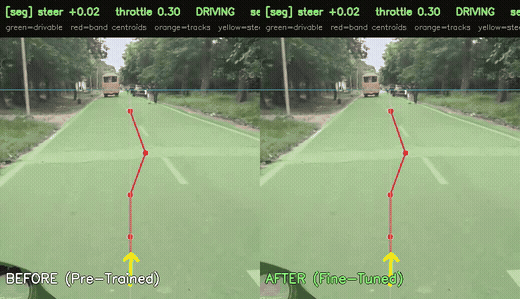

# Self-Driving RC Car — Campus Delivery Cart Prototype

A small autonomous vehicle built on [DonkeyCar](https://www.donkeycar.com/) and a
Raspberry Pi. The end goal is a **campus delivery cart**: it carries documents or
parcels between buildings with nobody driving it.

> **This is a prototype.** The point of this stage is to prove self-driving works
> end-to-end on cheap hardware before scaling it up.

<p align="center">
  
  
  <br/>
  <em><b>Dual-View Real-Time Edge Inference (~7.5 FPS on Raspberry Pi 4B):</b> Left: Camera view with Fast-SCNN drivable corridor overlay. Right: Extracted Black & White binary road mask (<a href="docs/results/bw_mask_output.mp4"><b>bw_mask_output.mp4</b></a>) fed into the geometric planner.</em>
</p>

---

## Perception, Steering & GPS Architecture

Navigating narrow pedestrian walkways between campus buildings requires solving a classic robotics challenge: **civilian GPS alone cannot steer a 30 cm cart on a 1.5 m footpath (civilian GPS has a 3–5 m error margin).**

The system splits autonomy into macro-routing and micro-corridor control:

- **Fast-SCNN Semantic Segmentation (Micro):** An INT8-quantized Fast-SCNN model (~1.1M params) segments raw front-camera frames directly on the Raspberry Pi 4B CPU at **~7.5 FPS** (136.6 ms latency, 110 MB RAM), outputting a dense binary drivable road mask resistant to paver joints and tree shadows.
- **Geometric Steering (NumPy & OpenCV):** OpenCV extracts spatial moments across 5 horizontal bands starting at `roi_top = 0.30` (calibrated lookahead). Vectorized NumPy slices compute lateral path error and heading angle (Δx, Δθ), feeding a tuned PD controller (`kp=1.2, kd=0.3`) for smooth centering without lane hunting. A 9px morphological closing filter bridges paving grids into a single corridor.
- **GPS Waypoints & Junction Bias (Macro):** `gps_nav.py` follows an OSMnx campus graph between buildings. At pathway forks and intersections, GPS injects a directional bias (`junction_bias`), pulling the vision corridor aim point toward the intended branch. A fail-closed geofence halts the cart if GPS fix is lost or boundaries are crossed.

---

## Edge Transfer Learning Comparison

<p align="center">
  
  <br/>
  <em><b>Pre-Trained (Left) vs Fine-Tuned (Right):</b> Domain-adapted Fast-SCNN eliminates road dropouts, suppresses background bleeding, and cleanly tracks path boundaries. At 8–10 km/h the cart gets a new steering decision every 33–38 cm of travel.</em>
</p>

---

## Knowledge Distillation & Transfer Learning

Training dense segmentation on custom campus roads without manual labeling:

```
[Raw Campus Video] ──▶ [Cloud Teacher: Mask2Former Swin-L] ──▶ [Dense Road Pseudo-Labels]
                                                                        │
[Edge Deployment: Raspberry Pi 4B] ◀── [INT8 Quantization] ◀── [Student: Fast-SCNN Fine-Tuning]
       (~7.5 FPS, 110 MB RAM)              (1.7 MB ONNX)              (Val IoU: 0.9782)
```

1. **Teacher Pseudo-Labeling:** 215M-parameter Mask2Former on AWS EC2 T4 GPU auto-labels 1,300+ campus video frames.
2. **Student Fine-Tuning:** Lightweight Fast-SCNN (~1.1M params) trained on distilled labels, achieving **0.9782 Val IoU** and **0% false emergency stops**.
3. **INT8 Quantization:** Exported to dynamic INT8 ONNX (`1.7 MB`), requiring only **110 MB RAM** on the Pi.

---

## Hardware Benchmarks (Raspberry Pi 4B, 64-bit OS)

Measured across 751 frames running headless on Debian Bookworm (`aarch64`):

| Metric | Measured Value | Practical Significance |
|---|---|---|
| **Inference Throughput** | **~7.5 FPS** (136.6 ms) | Real-time steering updates |
| **Model Size** | **1.7 MB** (INT8 ONNX) | Ultra-lightweight edge footprint |
| **Memory Usage (RSS)** | **110.6 MB** | Only 5.5% of 2GB RAM; zero OOM risk |
| **Sustained Thermals** | **76.0 °C** | Safe margin below 80 °C CPU throttle point |
| **Lookahead Horizon** | **`roi_top = 0.30`** | Mid-range lookahead preventing curve lag |

---

## Autonomy Modes

| Mode | Technology | Role | Runs on Pi? |
|---|---|---|:---:|
| **1. DonkeyCar** | Behavioral Cloning (CNN) | Track imitation from human demonstrations | Yes (~20 FPS) |
| **2. Fast-SCNN + OpenCV** | Geometric Segmentation | Real-time corridor segmentation & lookahead steering | **Yes (~7.5 FPS)** |
| **3. Mask2Former** | 215M Foundation Model | Offline teacher for zero-annotation dataset creation | No (Cloud GPU) |

---

## Hardware Architecture

```
FlySky Transmitter ──RF──▶ FlySky Receiver ──iBUS/UART──▶ Raspberry Pi 4B ──I2C──▶ PCA9685 ──PWM──▶ Steering Servo
                                                                │                                    └──▶ Throttle ESC
                                                            Pi Camera
```

- **Raspberry Pi 4B (2GB):** Runs edge ONNX runtime, iBUS decoder, and vehicle safety arbiter.
- **PCA9685:** 16-channel 12-bit I2C PWM driver for stable servo/ESC pulses.
- **FlySky TX/RX:** Manual override; Ch 5 switch flips instantly between Manual and Autonomous.

---

## Quick Start

```bash
# Clone and install dependencies
git clone https://github.com/GuptaOum/selfdriving-campus-cart.git
cd selfdriving-campus-cart
pip install -r requirements-train.txt

# Run Fast-SCNN benchmark on the Pi
cd pie
python test_pi.py
```

See [docs/AUTONOMY.md](docs/AUTONOMY.md) for full perception configuration and [memory/PROJECT_MEMORY.md](memory/PROJECT_MEMORY.md) for telemetry logs and calibration history.

## Acknowledgements

- [DonkeyCar](https://github.com/autorope/donkeycar) — autonomous vehicle platform
- [Fast-SCNN](https://arxiv.org/abs/1902.04502) — Fast Semantic Segmentation Network
- [Mask2Former](https://arxiv.org/abs/2112.01527) — Universal Image Segmentation
- [Cityscapes](https://www.cityscapes-dataset.com/) & [Sidewalk-Semantic](https://huggingface.co/datasets/segments/sidewalk-semantic) — benchmark datasets
