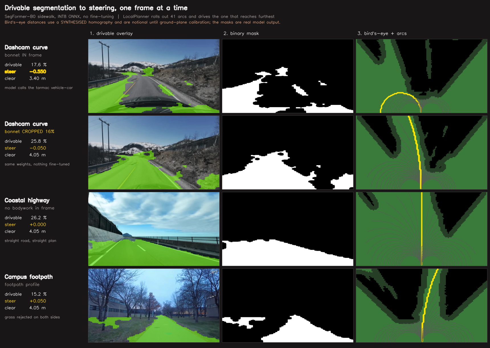
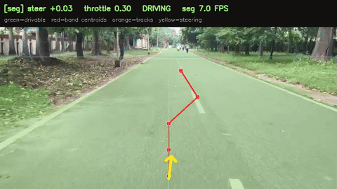
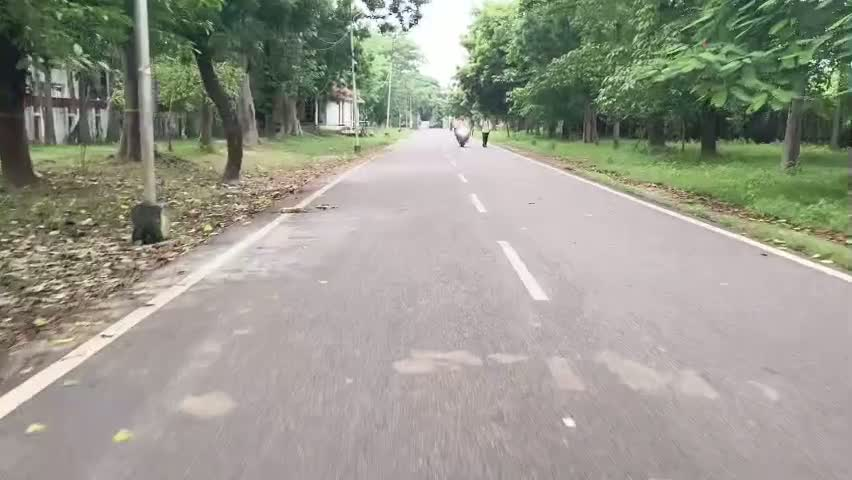
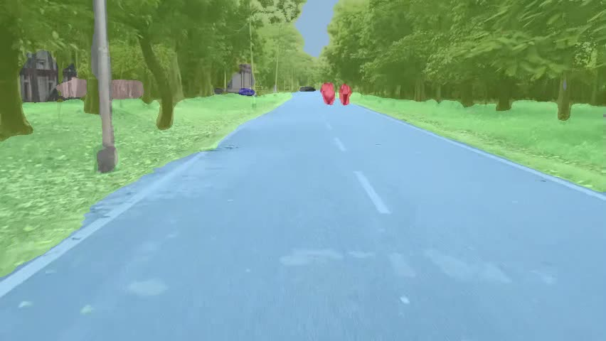
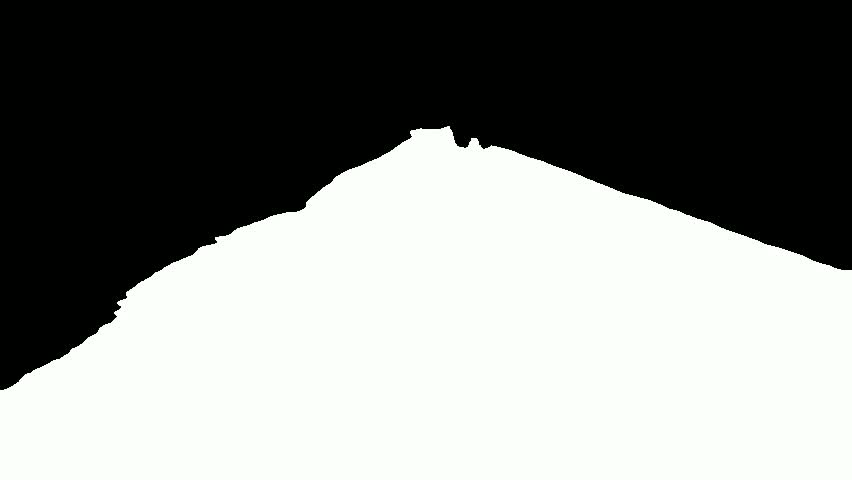

# Perception + planner output on single frames



`summary_grid.png` is the shareable 4x3 grid, rebuilt with
`scripts/make_results_grid.py`. Rows are frames, columns are stages.

Generated by `scripts/mask_and_plan_demo.py`, which runs the same `SegEngine`
and `LocalPlanner` the cart runs. Three panels each: drivable overlay, the
binary mask the planner consumes, and the bird's-eye occupancy grid with all
61 candidate arcs and the winner in yellow.

| Image | Frame | Drivable | Steer | Clear |
|---|---|---|---|---|
| `curve_no_crop.png` | dashcam, bonnet in frame | 17.6% | **-0.533** | 3.50 m |
| `curve_crop_16.png` | same frame, `--crop-bottom 0.16` | **25.8%** | **-0.067** | 4.05 m |
| `highway.png` | dashcam, no bodywork visible | 26.2% | +0.000 | 4.05 m |
| `campus_footpath.png` | campus walk, footpath profile | 15.2% | +0.033 | 4.05 m |

## What the curve pair shows

Same weights, same config, nothing fine-tuned. The only difference is that the
bottom 16% of the frame — the car's own bonnet — is removed before inference.

With the bonnet in shot, the model labels the **tarmac ahead** `vehicle-car` at
72%, drivable collapses to 8%, and the planner steers -0.53 off the road into
the snowbank. The body reads as `vehicle-car` and that label bleeds upward over
the road beside it, because the logits come out at 1/4 resolution with a wide
receptive field.

Cropped, the road segments cleanly and the plan runs straight up the
carriageway. `-0.07` is correct here: the bend is 20-30 m out and the planner's
horizon is 4 m, so it has nothing to turn for yet.

Fixing the camera mount beats cropping — a crop also discards the nearest
ground in view. `SEG_CROP_BOTTOM` defaults to 0.0.

## Caveat: the bird's-eye panel is illustrative

These were produced with a **synthesised** homography, derived from an assumed
camera height, FOV, and horizon row, so the demo can draw something before the
cart exists. Distances in panel 3 are notional and the corridor visibly narrows
with range where a real straight road would not.

Panels 1 and 2 are real — that is the actual INT8 SegFormer output.

Real metres require `scripts/calibrate_ground_plane.py --verify X,Y` against a
taped rectangle plus a fifth verification cross, run at the camera's final
mount height, and `--crop-bottom` matching `SEG_CROP_BOTTOM`.

## Reproducing
# Perception + planner output on single frames


`summary_grid.png` is the shareable 4x3 grid, rebuilt with
`scripts/make_results_grid.py`. Rows are frames, columns are stages.

Generated by `scripts/mask_and_plan_demo.py`, which runs the same `SegEngine`
and `LocalPlanner` the cart runs. Three panels each: drivable overlay, the
binary mask the planner consumes, and the bird's-eye occupancy grid with all
61 candidate arcs and the winner in yellow.

| Image | Frame | Drivable | Steer | Clear |
|---|---|---|---|---|
| `curve_no_crop.png` | dashcam, bonnet in frame | 17.6% | **-0.533** | 3.50 m |
| `curve_crop_16.png` | same frame, `--crop-bottom 0.16` | **25.8%** | **-0.067** | 4.05 m |
| `highway.png` | dashcam, no bodywork visible | 26.2% | +0.000 | 4.05 m |
| `campus_footpath.png` | campus walk, footpath profile | 15.2% | +0.033 | 4.05 m |

## What the curve pair shows

Same weights, same config, nothing fine-tuned. The only difference is that the
bottom 16% of the frame — the car's own bonnet — is removed before inference.

With the bonnet in shot, the model labels the **tarmac ahead** `vehicle-car` at
72%, drivable collapses to 8%, and the planner steers -0.53 off the road into
the snowbank. The body reads as `vehicle-car` and that label bleeds upward over
the road beside it, because the logits come out at 1/4 resolution with a wide
receptive field.

Cropped, the road segments cleanly and the plan runs straight up the
carriageway. `-0.07` is correct here: the bend is 20-30 m out and the planner's
horizon is 4 m, so it has nothing to turn for yet.

Fixing the camera mount beats cropping — a crop also discards the nearest
ground in view. `SEG_CROP_BOTTOM` defaults to 0.0.

## Caveat: the bird's-eye panel is illustrative

These were produced with a **synthesised** homography, derived from an assumed
camera height, FOV, and horizon row, so the demo can draw something before the
cart exists. Distances in panel 3 are notional and the corridor visibly narrows
with range where a real straight road would not.

Panels 1 and 2 are real — that is the actual INT8 SegFormer output.

Real metres require `scripts/calibrate_ground_plane.py --verify X,Y` against a
taped rectangle plus a fifth verification cross, run at the camera's final
mount height, and `--crop-bottom` matching `SEG_CROP_BOTTOM`.

## Reproducing

```
python scripts/mask_and_plan_demo.py --image frame.png --profile road \
    --crop-bottom 0.16 --vp 0.50 --lateral 3.5 --horizon 4.0 --out result.png
```

# Fast-SCNN Semantic Road Segmentation on Campus



`fastscnn_campus_demo.gif` — Real-time semantic road segmentation run over recorded campus footage, produced with our fine-tuned Fast-SCNN INT8 model (1.7 MB) at `roi_top = 0.30`. Steering in the overlay comes from `SegEngine.steer_from_mask`.

## Knowledge Distillation & Transfer Learning
- **Teacher Model:** Mask2Former Swin-L (215M parameters) running on AWS EC2 T4 GPU auto-extracted dense pseudo-ground-truth labels on unannotated raw campus footage.
- **Student Model:** Fast-SCNN (~1.1M parameters) fine-tuned on the teacher pseudo-labels with transfer learning.
- **Validation:** Converged at epoch 100 with validation IoU **0.9782** and **0% false emergency stop rate** across all campus test footage.
- **Pi 4 Edge Benchmark:** Sustained **7.11 FPS** (136.6 ms latency) and **110.6 MB RAM** on bare-metal 64-bit Raspberry Pi 4 hardware.

# Campus Video Reference Frames

### Raw Video (Trimmed)


### Panoptic Segmentation (Clean)


### Binary Drivable Mask

